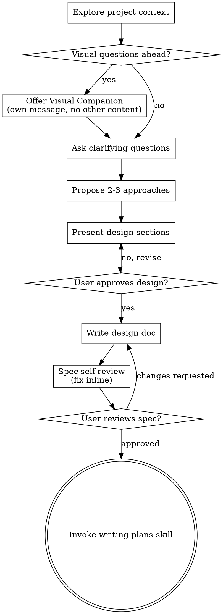

# 将想法头脑风暴为设计方案

通过自然的协作对话，帮助将想法转化为完整的设计与规格说明。

先理解当前项目上下文，然后一次提一个问题来细化想法。一旦理解要构建什么，呈现设计方案并获取用户批准。

<HARD-GATE>
在呈现设计方案并获得用户批准之前，不得调用任何实现类 skill、编写任何代码、搭建任何项目或采取任何实现动作。这适用于每一个项目，无论其看起来多么简单。
</HARD-GATE>

## 反模式：「这太简单了，不需要设计」

每个项目都必须经过此流程。待办列表、单函数工具、配置变更——无一例外。「简单」项目往往是未审视的假设造成最多浪费工作的地方。设计可以很短（真正简单的项目几句话即可），但你必须呈现设计并获得批准。

## 检查清单

你必须为以下每一项创建任务，并按顺序完成：

1. **探索项目上下文** — 查看文件、文档、近期提交
2. **提供 Visual Companion**（若话题涉及视觉问题）— 这是独立的一条消息，不与澄清问题合并。见下文 Visual Companion 章节。
3. **提出澄清问题** — 一次一个，理解目的/约束/成功标准
4. **提出 2–3 种方案** — 含权衡与你的推荐
5. **呈现设计** — 按复杂度分节呈现，每节后获取用户批准
6. **撰写设计文档** — 保存到 `docs/superpowers/specs/YYYY-MM-DD-<topic>-design.md` 并提交
7. **规格自检** — 快速内联检查占位符、矛盾、歧义、范围（见下文）
8. **用户审阅书面规格** — 在继续之前请用户审阅规格文件
9. **过渡到实现** — 调用 writing-plans skill 创建实现计划

## 流程图

**终态是调用 writing-plans。** 不要调用 frontend-design、mcp-builder 或任何其他实现类 skill。头脑风暴之后唯一可调用的是 writing-plans。

## 流程说明

**理解想法：**

- 先查看当前项目状态（文件、文档、近期提交）
- 在提出详细问题之前评估范围：若请求描述多个独立子系统（如「构建含聊天、文件存储、计费、分析的平台」），立即指出。不要在一个需要先拆解的大项目上花时间细化细节。
- 若项目过大无法写单一规格，帮助用户拆解为子项目：有哪些独立部分、如何关联、应按什么顺序构建？然后对第一个子项目走正常设计流程。每个子项目各自经历 spec → plan → implementation 周期。
- 对范围合适的项目，一次提一个问题细化想法
- 尽量用选择题，开放式也可以
- 每条消息只问一个问题——若某话题需深入探索，拆成多个问题
- 聚焦理解：目的、约束、成功标准

**探索方案：**

- 提出 2–3 种不同方案及权衡
- 以对话方式呈现选项，附推荐与理由
- 先给出推荐选项并解释原因

**呈现设计：**

- 一旦认为理解要构建什么，呈现设计
- 每节篇幅随复杂度缩放：简单则几句话，复杂则 200–300 字
- 每节后询问是否看起来正确
- 覆盖：架构、组件、数据流、错误处理、测试
- 若有不清楚之处，随时准备回去澄清

**为隔离与清晰而设计：**

- 将系统拆成职责单一的小单元，通过明确定义的接口通信，可独立理解与测试
- 对每个单元应能回答：它做什么、如何使用、依赖什么？
- 能否在不读内部实现的情况下理解单元？能否改内部而不破坏调用方？若不能，边界需调整。
- 更小、边界清晰的单元也便于你工作——你能更好推理可一次装入上下文的代码，文件聚焦时编辑更可靠。文件过大往往是职责过多的信号。

**在既有代码库中工作：**

- 提出变更前先探索现有结构，遵循既有模式。
- 若现有代码有问题影响工作（如文件过大、边界不清、职责纠缠），在设计中包含有针对性的改进——如同优秀开发者在工作中改进代码。
- 不要提出无关重构，聚焦当前目标。

## 设计之后

**文档：**

- 将已验证的设计（规格）写入 `docs/superpowers/specs/YYYY-MM-DD-<topic>-design.md`
  - （用户对规格位置的偏好可覆盖此默认）
- 若可用，使用 elements-of-style:writing-clearly-and-concisely skill
- 将设计文档提交到 git

**规格自检：**
撰写规格文档后，以新视角审视：

1. **占位符扫描：** 是否有 "TBD"、"TODO"、不完整章节或模糊需求？修复它们。
2. **内部一致性：** 各节是否矛盾？架构是否与功能描述一致？
3. **范围检查：** 是否足够聚焦以写单一实现计划，还是需要进一步拆解？
4. **歧义检查：** 是否有需求可被两种不同方式理解？若有，选定一种并写明确。

内联修复问题即可，无需重新审阅——修完继续。

**用户审阅关卡：**
规格自检通过后，请用户审阅书面规格再继续：

> "Spec written and committed to `<path>`. Please review it and let me know if you want to make any changes before we start writing out the implementation plan."

等待用户回复。若要求修改，修改后重新跑规格自检循环。仅在用户批准后继续。

**实现：**

- 调用 writing-plans skill 创建详细实现计划
- 不要调用任何其他 skill。writing-plans 是下一步。

## 关键原则

- **一次一个问题** — 不要用多个问题淹没用户
- **优先选择题** — 比开放式更容易回答
- **严格 YAGNI** — 从所有设计中移除不必要的功能
- **探索备选** — 敲定前始终提出 2–3 种方案
- **增量验证** — 呈现设计，获批后再继续
- **保持灵活** — 有不清楚时回去澄清

## Visual Companion

基于浏览器的伴侣工具，在头脑风暴中展示 mockup、图表与视觉选项。作为工具提供——不是模式。接受伴侣仅表示在适合视觉呈现的问题上可用；并非每个问题都走浏览器。

**提供伴侣：** 当预期后续问题涉及视觉内容（mockup、布局、图表）时，征求一次同意：
> "Some of what we're working on might be easier to explain if I can show it to you in a web browser. I can put together mockups, diagrams, comparisons, and other visuals as we go. This feature is still new and can be token-intensive. Want to try it? (Requires opening a local URL)"

**此提议必须是独立的一条消息。** 不要与澄清问题、上下文摘要或其他内容合并。消息应只包含上述提议，别无他物。等待用户回复后再继续。若拒绝，仅用文本继续头脑风暴。

**逐题决策：** 即使用户接受，对**每个问题**单独决定是否用浏览器或终端。判断标准：**用户是通过看更容易理解，还是通过读？**

- **用浏览器** 处理本质上是视觉的内容 — mockup、线框图、布局对比、架构图、并排视觉设计
- **用终端** 处理文本内容 — 需求问题、概念选择、权衡列表、A/B/C/D 文字选项、范围决策

关于 UI 的问题不自动是视觉问题。「在此上下文中 personality 指什么？」是概念问题——用终端。「哪种向导布局更好？」是视觉问题——用浏览器。

若用户同意使用伴侣，继续前请阅读详细指南：
`skills/brainstorming/visual-companion.md`
