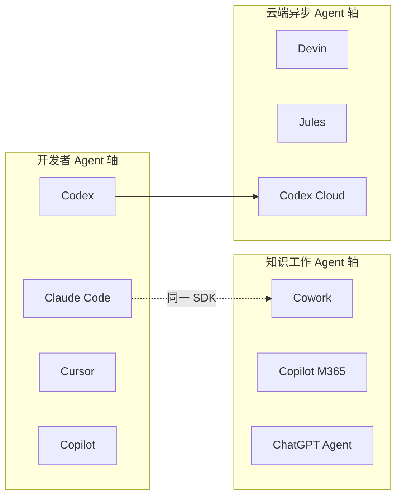

# Codex 与 Claude Cowork：AI Agent 时代的两条进化路径

> 研究时间：2026年6月23日 | 所属领域：AI Agent / 软件工程自动化 / 知识工作自动化 | 研究对象类型：产品（双对象对比研究）

---

## 一、一句话定义

**OpenAI Codex**（2025–2026 语境）是绑定 ChatGPT 订阅的全栈「软件工程 Agent 平台」——从开源 CLI 到桌面 App、IDE 插件、云端沙箱，让开发者把编码任务「委派」给 AI，在本地或云端跑完交 PR。

**Anthropic Claude Cowork** 是 Claude Desktop 内的「知识工作 Agent 工作区」——同一套 Agent 架构，去掉终端，在本地 VM 沙箱里读写文件夹、调用 Connectors/Skills，面向非开发者的文档整理、数据分析、报告撰写等日常任务。

两者表面都在做「Agent」，但一个锚定 **代码与工程**，一个锚定 **文件与知识劳动**；一个从 2021 年的「补全模型」复活为 2025 年的「委派平台」，一个从 2024 年的 Computer Use 实验下沉为 2026 年的 Desktop 产品。这是 OpenAI 与 Anthropic 在 Agent 时代各自选的一条路。

---

## 二、纵向分析：从诞生到当下

### 2.1 OpenAI Codex——一个名字，两段生命

#### 起源：GPT-3 发现自己会写代码

2020 年 GPT-3 发布时，OpenAI 团队注意到一个现象：模型不仅能生成自然语言，还能产出可运行的 Python 程序。Mark Chen 牵头，在 GitHub 公开代码（论文称约 159GB Python、5400 万仓库）上对 GPT-3 做 fine-tune，训练出专精代码的模型，并引入 **HumanEval** 基准——这后来成为整个 AI 编程赛道的事实标准。

2019 年 Microsoft 已向 OpenAI 投资 10 亿美元。当代码能力被验证后，GitHub（2018 年被 Microsoft 收购）自然成为第一个商业化出口。

**2021 年 6 月 29 日**，GitHub Copilot Technical Preview 发布，由 OpenAI Codex 驱动。GitHub 博客称它比 GPT-3 的代码能力「显著更强」。12 天后，**2021 年 7 月 7 日**，Mark Chen 为第一作者的论文 *Evaluating Large Language Models Trained on Code* 公开。再过一个月，**2021 年 8 月 10 日**，OpenAI 官方宣布 Codex API 进入私有 beta、免费使用。Greg Brockman 称其为「GPT-3 的后裔」。

OpenAI 做 Codex 的逻辑很清晰：GPT-3 只能「影响读者心智」，Codex 能**产出可执行代码**，通过 API 直接驱动作业软件。公开代码数据丰富，专精模型在代码映射任务上更高效。与 Microsoft/GitHub 合作，Copilot 作为首个大规模商业化出口——OpenAI 做模型，GitHub 做编辑器集成与分发。

#### 第一代黄金期：Copilot 定义品类，Codex 做引擎

2022 年是 Copilot 从 preview 走向 GA 的一年。**2022 年 6 月 21 日** Copilot 对个人开发者 GA，定价 $10/月；Technical Preview 期间约 **120 万**用户。Nadella 在 FY22 Q4 财报电话中称 GA 首月约 **40 万付费**订阅。到 **2023 年 1 月**，累计 **100 万+** 使用者。

**2023 年 2 月 14 日**，Copilot for Business GA，底层「升级 Codex 模型」并加入安全漏洞过滤器。**2023 年 3 月 22 日**，GitHub 发布 Copilot X 愿景——接入 GPT-4、Chat、PR 描述、CLI、Docs。产品形态从「编辑器内补全」转向「全生命周期 AI 助手」；底层从专用 Codex 向通用 GPT-4 迁移。

GitHub 官方数据：启用 Copilot 的文件中，**35–46%** 的代码由 AI 生成。Copilot 定义了「AI 结对编程」这个品类。

#### 2023 年 3 月：第一代 Codex 被「通用模型吞噬」

**2023 年 3 月 23 日**，OpenAI 正式关停 Codex API。`code-davinci-*`、`code-cushman-*` 等模型下线，建议迁移至 GPT-3.5-Turbo / GPT-4。

官方理由：「最新 GPT-3.5 模型在编码任务上已更优」；通用模型还能处理文档、错误信息、架构推理。维护多条模型线的成本太高，Copilot 已验证「补全 + 通用推理」更实用。

社区反应复杂：短通知期引发不满；Sam Altman 推文称将为研究人员保留访问；依赖 Codex API 的第三方需改接口。但 Copilot 用户几乎无感——GitHub 已切到新模型。

**2023 年 3 月至 2025 年 4 月**，「Codex」作为模型/API 品牌进入约两年空窗。Copilot 继续独立演进。这个名字，暂时死了。

#### 2025 年：品牌复活，战略完全转向 Agent

转折点来得突然。**2025 年 4 月 16 日**，随 o3 / o4-mini 发布，OpenAI 推出 **Codex CLI**——Rust 编写、Apache-2.0 开源，并宣布 $100 万开源资助计划。GitHub 仓库 `openai/codex` 截至 2026 年已有 **9 万+ stars**。

一个月后，**2025 年 5 月 16 日**，OpenAI 发布 **ChatGPT 云端 Codex Agent** 研究预览。模型 **codex-1**（o3 优化版 + RL），在沙箱并行任务、可提 PR。同步发布 **codex-mini**（o4-mini 变体），为 CLI 默认模型。

Alexander Embiricos 任新 Codex Product Lead（2024 入职 OpenAI，前 Remotion/Multi 创始人）。他在公开访谈中的决策逻辑：瓶颈从模型能力转向「人类如何委派与审查」；o 系列推理 + RL 使**长程自主任务**可行；开发者需求从「Tab 补全」转向「委派整段工程任务」。

**2025 年 6 月 3 日**，Codex 向 ChatGPT Plus 开放；任务执行可开互联网。**2025 年 9 月**，Codex 统一为单一产品体验（CLI / IDE / Web / GitHub / iOS 互通）。**2025 年 9 月 15 日** 发布 **GPT-5-Codex**，可独立运行最长约 **7 小时**。**2025 年 10 月 6 日** DevDay 2025：Codex **GA**；Slack 集成、Codex SDK、Admin 工具；日活自 8 月初 **10x+**；GPT-5-Codex 三周 **40T tokens**。Sam Altman 称：「OpenAI 今日几乎所有新代码都由 Codex 用户编写。」

#### 2025 末–2026：专用模型回归 + 多 Agent 指挥中心

看似与 2023「通用优于专精」矛盾，实则场景不同：
- **2023**：API 补全/短生成 → 通用 GPT 足够
- **2025+**：Agent 需 tool use、测试循环、PR 风格、Compaction → 需 **GPT-5.x-Codex** 专精变体

约 14 个月内发布 codex-1 → GPT-5-Codex → 5.1-Max → 5.2 → 5.3，迭代极快。

**2025 年 11 月 19 日**，GPT-5.1-Codex-Max 发布 Compaction 跨上下文窗口；内部 **95%** 工程师周用 Codex，PR 量约 **+70%**。**2025 年 12 月 18 日**，GPT-5.2-Codex 增强 Windows 环境、长程 refactor、网络安全。**2026 年 2 月 2 日**，**Codex 桌面 App（macOS）** 发布——多 Agent 并行、Worktrees、Skills、Automations。**2026 年 2 月 5 日**，GPT-5.3-Codex 合并编码与推理栈，比前代快 25%，OpenAI 称参与「自举」开发。**2026 年 3 月 4 日**，Codex App **Windows** 版上线。

OpenAI 官方在 2026 年的产品矩阵：
- **Codex CLI**：本地终端 Agent（开源）
- **Codex Web**：`chatgpt.com/codex` 云端委派
- **Codex App**：多 Agent 指挥中心
- **IDE Extension**：VS Code / Cursor / Windsurf / JetBrains
- **Automations / Slack / GitHub Action**：CI/CD、Issue 分流

过去一个月 **100 万+** 开发者使用 Codex（官方数据，2026 年 2 月 Codex App 发布时）。

#### 阶段划分（Codex）

| 阶段 | 时间 | 核心特征 | 核心矛盾 |
|------|------|----------|----------|
| 萌芽期 | 2020–2021 | 专精代码模型 + Copilot 合作 | 能力 vs 商业化路径 |
| 规模化期 | 2022–2023 初 | Copilot GA、百万用户 | 补全够用 vs Agent 想象 |
| 空窗/转型期 | 2023–2025 | API 退役、Copilot 接 GPT-4 | 专精 vs 通用 |
| Agent 复活期 | 2025–2026 | CLI→Cloud→App 全栈 | 委派 vs 结对、与 Copilot 竞合 |

#### 争议与阴影

**2022 年 11 月**，Doe v. GitHub, OpenAI, Microsoft 集体诉讼——指控 Copilot 训练未遵守开源许可证。NYU/Calgary 研究称 Copilot 建议代码约 **40%** 含安全漏洞。

**2025+**，「Codex」同时指 2021 模型与 2025 Agent，文档与教程易混。**2026 年 2 月**，GPT-5.3-Codex「自举」叙事引发能力宣传与验证讨论。

---

### 2.2 Anthropic Claude Cowork——从 Computer Use 到「Claude Code for the rest of us」

#### 起源：影子用法倒逼产品化

Anthropic 的 Agent 故事，要从 **Computer Use** 说起。

**2024 年 10 月 22 日**，Anthropic 发布 Computer Use API beta——Claude 3.5 Sonnet 升级版，模型能「看屏 + 点按」。**10 月 31 日**，Claude Desktop macOS/Windows beta 上线，但仍是 Chat 壳，没有 agent 能力。**11 月 25 日**，**MCP（Model Context Protocol）** 开源，Desktop 支持 local MCP——这是后来整个 Claude 生态的连接器标准。

2025 年，开发者 Agent 层成型。**2 月 24 日**，Claude 3.7 Sonnet + **Claude Code** Research Preview 发布。**5 月 22 日**，Claude Code GA 1.0。**10 月**，Claude Desktop GA；Claude Code Web 向 Pro/Max 开放。

Claude Code 迅速成为终端原生 Agent 品类的标杆。GitHub **13.3 万+ stars**；JetBrains 2026 年调查：工作采用率从 2025 年 4–6 月的 ~3% 增长 **6 倍**至 18%，CSAT **91%**、NPS **54**，为各工具最高。

但 Anthropic 内部观察到一个「影子用法」：
- Marketing、Data 等非工程团队绕过 Chat，直接用 **Claude Code** 做复杂多步工作；
- 开发者用 Code 做度假调研、幻灯片、邮件整理、文件整理等非编码任务。

Boris Cherny（Claude Code 创建者）在 X 上列举这些用法。结论：**用户要的是 agent 能力，不是 terminal 界面**。

#### 诞生节点：2026 年 1 月 12 日

**2026 年 1 月 12 日**，Anthropic 发布 **Claude Cowork** Research Preview。

官方表述：**「Claude Code for the rest of your work」**——同一套 Claude Agent SDK，GUI 封装，面向非开发者知识工作者。

首发形态：
- **仅 macOS + Claude Max**（$100/$200/月）
- 用户选择工作文件夹，Claude 在沙箱 VM 中自主规划、并行执行
- 可读写本地文件、调用 Connectors/MCP/Skills/Plugins
- 可与 Claude in Chrome 配合做浏览器自动化

VentureBeat 报道：Cowork 团队约 **4 人**，**~10 天**用 Claude Code 自举开发整个功能——这本身成了产品叙事的一部分。

**2026 年 1 月 13 日**，Anthropic 宣布 **Anthropic Labs** 正式扩编，Mike Krieger（Instagram 联创、前 CPO）加入，与联创 Ben Mann 共领。Cowork 列为 Labs 产出之一。Daniela Amodei（President）：*"Labs gives us room to break the mold and explore"*。

#### 快速扩 tier：从 Max 精英到全员可用

**2026 年 1 月 16 日**，Cowork 扩展至 **Pro**（$20/月）——Engadget 等媒体报道，距发布仅 4 天。

**2026 年 1 月 23 日**，扩展至 **Team / Enterprise**；加入 @项目上下文、Chrome 协同。

**2026 年 2 月 10–12 日**，**Windows 版 Cowork** 上线（具体日期来源略有出入）。

**2026 年 2 月 24 日**，**Plugins** 发布——把 Skills + Connectors + slash commands + sub-agents 文件化打包。

**2026 年 2 月 25 日**，**Scheduled Tasks**（`/schedule`）——需 Desktop 常开、电脑 awake。

**2026 年 4 月 9 日**，**GA**：RBAC、组预算、Usage Analytics、OpenTelemetry、Zoom MCP、按工具 MCP 权限。同期发布 Managed Agents 等企业 Agent 栈组件。

**2026 年 5 月 25 日**，Engineering 长文《How we contain Claude》详解 Cowork VM 架构；承认 Files API 外泄漏洞并描述 MITM proxy 修复。

**2026 年 6 月 5 日**，官方 Cowork Product Guide 发布。

从 Research Preview 到 GA，**不到 3 个月**——竞争窗口驱动了极速 ship。

#### 决策逻辑：为什么 Cowork 长这样

**1. Bottom-up 而非 top-down**

先 Code 验证 agent loop，再抽象为 Cowork。对标 Microsoft Copilot 的 OS 级整合，Anthropic 选 **folder-scoped + VM 隔离**——更轻、更可控。

**2. 安全优先于功能**

非技术用户无法审 bash → 采用 **full/local VM**（Apple Virtualization / Windows HCS），而非 Claude Code 式逐条审批。Simon Willison（2026-01-12）评价：VM 默认沙箱优于 `--dangerously-skip-permissions`。

**3. 极速 ship + Labs 机制**

~10 天 MVP，RP 快速扩 tier。Ben Mann 的产品哲学：「为 6 个月后的模型能力而构建」。

**4. 开放生态**

MCP / Skills / Plugins 文件化、GitHub 开源集合。Labs 文称 MCP **1 亿月下载**——生态位战略，避免 walled garden。

**5. GA 重心转向企业治理**

2026-04 GA 增加 OTel/Analytics/RBAC——官方判断 enterprise 瓶颈在 **compliance layer** 而非 agent 能力本身。

#### 阶段划分（Cowork 及前置生态）

| 阶段 | 时间 | 核心特征 | 核心矛盾 |
|------|------|----------|----------|
| 能力基建 | 2024 Q4 | Computer Use + MCP + Desktop | 能看屏 vs 敢放权 |
| 开发者验证 | 2025 | Claude Code 爆发 | 终端 vs 普及 |
| 知识工作下沉 | 2026 Q1 | Cowork RP→GA | 能力 vs 安全/合规 |
| 企业治理 | 2026 Q2 | RBAC/OTel/Plugins | 采用 vs 审计 |

#### 争议与口碑

**正面**：Simon Willison 称「把 Claude Code 能力带给更广泛受众」；Lenny Rachitsky 用 320 期播客 transcript 做主题挖掘；企业案例（Zapier、Jamf、Airtree）见 GA 博客。

**批评**：
- **Prompt injection**：非技术用户难以识别可疑 agent 行为
- **Files API 外泄**：2025-10 已报告，Cowork 发布时仍可利用 workspace 内恶意文件外泄
- **合规/审计缺口**：Cowork 活动不在 enterprise audit logs、Compliance API 中（第三方合规分析多次强调）
- **Token 消耗**：截图、多步 agent 快速打满 Pro 配额（社区共识为 Chat 的 5–20 倍，非官方精确倍数）
- **产品定位尴尬**：Claire Vo 称对新手太复杂、对专家不如直接用 Code

Peter McCrory（Anthropic 经济学负责人）：劳动影响将「非常不均匀」，数据录入类岗位风险更高。

---

## 三、横向分析：竞争图谱

### 3.1 场景判断：Codex 与 Cowork 是「同赛道不同轴」

Codex 和 Cowork **不是直接竞品**。它们共享「Agent 委派」范式，但锚定不同劳动类型：

| 维度 | OpenAI Codex | Anthropic Claude Cowork |
|------|-------------|------------------------|
| 核心劳动 | 软件工程（写代码、修 bug、提 PR） | 知识工作（文档、表格、文件整理） |
| 界面 | CLI / IDE / 桌面 App / Web | Claude Desktop Tab |
| 沙箱 | 本地 + 云端 GitHub 仓库 | 本地 VM + 文件夹 scope |
| 目标用户 | 开发者、DevOps | 法务、财务、运营、市场 |
| 订阅 | ChatGPT Plus $20+ | Claude Pro $20+ |
| 开源 | CLI 开源（9 万+ stars） | Agent SDK 部分开放，Cowork 闭源 |
| 2026 工作采用率 | ~3%（JetBrains） | 无单独披露（含在 Claude 订阅） |

更准确的横向对比，是把 Codex 放进 **「开发者 Agent」** 赛道，Cowork 放进 **「桌面知识工作 Agent」** 赛道——但两者在 **2026 年 Agent 平台战争** 中代表 OpenAI 与 Anthropic 的「执行层」产品，值得放在一起看。

### 3.2 Codex 在开发者 Agent 赛道

**场景 C：竞品充分（3 个及以上）**。选取最具代表性的 4 个对比。

#### vs Anthropic Claude Code

Claude Code 是 Codex 最直接的对手——同为终端/CLI 原生 Agent，2026 年工作采用率并列 **18%**。

| 对比项 | Codex | Claude Code |
|--------|-------|-------------|
| 模型 | GPT-5.5 / 5.3-Codex 系列 | Opus/Sonnet 4.x |
| 形态 | CLI + App + IDE + Cloud 全栈 | CLI 为主 + Desktop + Web + IDE |
| MCP | 支持 | 支持最全（OAuth、Channels、Hooks） |
| 多 Agent | Subagents、Worktrees | Agent Teams、Dynamic Workflows |
| 满意度 | — | CSAT 91%、NPS 54（最高） |
| 社区分工 | 「Codex for keystrokes, Claude Code for commits」 | 复杂重构/全仓库 Agent 首选 |

HN 共识：「Claude Code 是 senior architect，Cursor 是 pair programmer。You want both.」Terminal-Bench 2.0 上 Codex（~77%）领先 Claude Code（~65%），但盲测代码质量 Claude Code 胜率更高。

用户选 Codex：已有 ChatGPT 订阅、要 CLI 自动化 + 云端 PR 委托、Terminal/DevOps 场景。
用户选 Claude Code：复杂多文件重构、CI/CD 集成、最高满意度、终端工作流。

#### vs Cursor

Cursor 定义「AI-first IDE」品类，~$2B ARR，18% 工作采用率。

Cursor 是 **人在环内**——Tab 补全、可视化 diff、多模型聚合。Codex 是 **委派型**——描述任务，后台跑完交结果。社区主流工作流：**Cursor（IDE 流）+ Claude Code 或 Codex（终端 Agent）** 组合拳。

Cursor 2025 年 6 月从「请求制」改为「积分池制」，引发用户反弹。Agent 重度用户月账单可达 $180–500 溢出——与 Codex「订阅内含 + API 溢出」双轨形成对比。

#### vs GitHub Copilot

Copilot 是 Codex **2021 年的同源兄弟**，2026 年已是 **竞合分离**。

Copilot：29% 工作采用率（第一，增速放缓）；~4.7M 付费用户；$10/月入门；企业合规最成熟；2026 年 6 月全面转向 AI Credits 用量计费。

Copilot 活成「安全的企业默认选项」——42% 市场份额，但复杂 Agent 自主性弱于 Codex/Claude Code。新 Codex 属 OpenAI/ChatGPT，与 Microsoft/GitHub 的 Copilot 是同业竞争。

**Copilot Workspace** 技术预览已于 2025 年 5 月 30 日 sunset——GitHub 的「云端 Agent 工作区」尝试失败，OpenAI Codex Cloud 接过了这个叙事。

#### vs Google Antigravity / Jules

Google 2026 年 6 月将 Gemini Code Assist 和 Gemini CLI **迁移至 Antigravity 平台**——桌面 App + `agy` CLI + SDK + Managed Agents API。Antigravity 2.0 支持 subagent 编排、定时任务。

Jules 做异步云端 Agent（克隆 repo 到 GCE VM，输出 PR）；Antigravity 做同步+编排。工作采用率 6%（上线约 2 个月），Google 工具频繁 rebranding 引发社区疲劳。

### 3.3 Cowork 在知识工作 Agent 赛道

Cowork 的竞品不是 Codex，而是：

#### vs Microsoft Copilot（Office/Windows 整合）

Microsoft 将 AI 嵌入 Word/Excel/Teams/Windows——OS 级、应用内整合。Cowork 选 **folder-scoped + Desktop Tab**——更轻，不强迫换工具。

The Decoder 曾报道 Microsoft 适配 Cowork 技术进 Copilot，细节未在 Anthropic 一手源确认。战略上，Microsoft 有分发优势（Enterprise 900M+ Office 用户），Anthropic 有 Agent 架构深度（MCP、Skills、VM containment）。

#### vs ChatGPT Agent / Operator

OpenAI 的 Operator（2025 初）和 ChatGPT 的 computer use 能力，与 Cowork 在「非开发者桌面 Agent」上正面交锋。OpenAI 2026 年 Codex App 也扩展了 in-app browser、文件预览（PDF/表格/幻灯片）——**边界在模糊**。

Codex App 官方表述：「现有 IDE 和终端工具不是为 multi-agent 编排而建的」——这同样适用于 Cowork 要解决的「知识工作者委派」场景。两者从开发者/non-developer 两端向中间挤压。

#### vs 传统 RPA + AI（UiPath、Automation Anywhere + LLM）

Cowork 不是传统 RPA——没有录屏回放，而是 LLM 理解意图 + 工具调用。优势：灵活、自然语言；劣势：非确定性、审计链不完整。Enterprise GA 后 OTel/Analytics 试图补齐，但第三方仍称 Compliance API 存在差距。

### 3.4 生态位与 2026 格局

**2026 年开发者共识**：不再「只选一个」，而是组合——Cursor + Claude Code，或 Copilot（企业合规）+ 专用 Agent。

**定价趋同**：$20/月成为个人档地板（Cursor Pro = Claude Pro = Codex Plus = Replit Core）。

**用量计费成为常态**：Cursor（2025.6）、Copilot（2026.6）均已转向 credits/积分池。

**Claude Code 是最大变量**：增速最快、满意度最高，若趋势延续可能在 2026 年底超越 Copilot 个人采用率。

**Codex 的 paradox**：知晓率 27%、采用率 3%——「知道的人多、深度用的人少」，但 CLI 9 万+ stars、100 万+ 月活开发者说明从早期采用者向主流渗透中。

---

## 四、横纵交汇洞察

### 4.1 历史如何塑造了当下的竞争位置

Codex 的 **2023 年 API 退役**，表面是失败，实则是战略收缩——OpenAI 把「代码补全」让给 Microsoft/GitHub Copilot，自己押注 ChatGPT 通用路线。这导致 2023–2025 两年空窗，但也让 OpenAI 在 Agent 时代可以**不受 Copilot 产品定义束缚**，以全新形态复活 Codex。

2023 年「通用优于专精」的决策，在 2025 年被 **GPT-5.x-Codex 专精模型族** 部分逆转——不是推翻，是 **场景分化**：短补全用通用，长 Agent 用专精。我的判断是：OpenAI 在 2023 砍的是「API 时代的专精」，2025 建的是「Agent 时代的专精」。

Cowork 的路径相反——**没有空窗，是连续下沉**。Computer Use（2024）→ Claude Code（2025）→ Cowork（2026），每一步都在验证「Agent 能力可以下放给更多人」。Boris Cherny 观察到的影子用法，是 Cowork 诞生的真实土壤——这不是 top-down 的战略规划，是 bottom-up 的需求倒逼。

Anthropic 选 **Labs 机制** 快速 ship（~10 天 MVP），OpenAI 选 **DevDay GA + 开源 CLI** 建立生态——两者都反映了 2026 年 Agent 竞争的紧迫性：窗口期以月计，不以年计。

### 4.2 竞品的纵向对比：两条 Agent 哲学

如果把 Codex 和 Cowork 放到同一条时间线上，会看到 OpenAI 与 Anthropic 的 **Agent 哲学分野**：

| | OpenAI（Codex） | Anthropic（Cowork） |
|--|-----------------|---------------------|
| 起点 | 代码模型 → Copilot 合作 → API 退役 → Agent 复活 | Computer Use → Code → Cowork 下沉 |
| 核心隐喻 | 「委派给工程师」 | 「留言给同事」 |
| 安全模型 | 沙箱 + 可选开网；开发者自负 | VM containment；非用户审 bash |
| 生态策略 | 开源 CLI + ChatGPT 捆绑 | MCP 开放 + Skills/Plugins 文件化 |
| 商业化 | 订阅内含 + 用量溢出 | 订阅内含，无独立 SKU |
| 内部采用 | 95% 工程师周用 Codex | ~4 人团队 10 天自举 Cowork |

OpenAI 的 Codex 故事是 **「同一个名字的凤凰涅槃」**——从模型到 Agent 平台，产品矩阵最全（CLI/App/IDE/Cloud/Slack/GitHub Action）。Anthropic 的 Cowork 故事是 **「Code 的非开发者版」**——不重新发明 Agent，而是换界面、换沙箱、换受众。

### 4.3 优势的历史根源

**Codex 今天的优势**：
- **ChatGPT 用户基数**：Plus/Pro/Business 订阅内含，降低 adoption 摩擦
- **全栈形态**：唯一同时覆盖 CLI + 桌面 App + IDE + 云端 + CI 的产品
- **开源 CLI 社区**：9 万+ stars 建立开发者信任与贡献
- **专用 Codex 模型迭代速度**：14 个月 5 代，Agent 场景持续优化

**Cowork 今天的优势**：
- **Claude Code 的 Agent 架构背书**：同一 SDK，能力已验证
- **MCP 生态**：1 亿月下载，Connectors/Plugins 最成熟
- **VM containment 对非技术用户友好**：不需要理解 bash 审批
- **Labs 快速迭代文化**：RP 到 GA 不到 3 个月

### 4.4 劣势的历史根源

**Codex**：
- **命名混淆**：2021 模型 vs 2025 Agent，伤害认知
- **与 Copilot 竞合**：同一母公司生态（Microsoft）内的复杂关系
- **采用率滞后**：3% vs Claude Code 18%，「知道但不用」
- **2023 API 退役遗留**：第三方开发者信任损伤

**Cowork**：
- **Token 消耗**：Agent 任务烧配额，Pro 用户易触顶 → 倒逼升 Max
- **合规/审计缺口**：Enterprise 采购障碍
- **Desktop 依赖**：Scheduled Tasks 需本机 awake，无云执行
- **定位尴尬**：对新手复杂，对专家不如 Code——「夹心层」风险

### 4.5 未来推演：三个剧本

#### 剧本一：最可能——「双轴收敛，各守疆界」

Codex 继续深耕开发者 Agent 全栈，Cowork 继续下沉知识工作者。两者边界在 2026–2027 年缓慢模糊（Codex App 已支持 PDF/表格预览；Cowork 已支持 Plugins 和 Scheduled Tasks），但不会正面融合——因为 **订阅绑定**（ChatGPT vs Claude）是各自商业核心。

开发者主流工作流稳定为 **Cursor + Claude Code/Codex** 组合；非开发者 Agent 市场由 Cowork 与 Microsoft Copilot 瓜分。Codex 采用率从 3% 向 10% 爬升，Cowork 无独立 ARR 披露但驱动 Claude Max 升级。

#### 剧本二：最危险——「合规事故 + 信任崩塌」

Cowork 的 VM containment 被 prompt injection 或恶意文件攻破（Files API 外泄已有先例）；或 Codex 在不可信 repo 上执行导致供应链攻击（两者均有 CVE 披露）。社区共识已是「不要对不可信 repo 直接跑 Agent」——一次高调事故可能触发 Enterprise 采购冻结。

对 Cowork 而言，audit log 缺口是定时炸弹；对 Codex 而言，「自举」叙事若被证伪，将伤害技术可信度。版权诉讼（Doe v. GitHub）若终局不利，对整个 AI 编程赛道是系统性风险。

#### 剧本三：最乐观——「Agent 成为默认劳动界面」

2027 年，Agent 委派成为知识工作和软件开发的 **默认交互模式**——Chat 退居二线。Codex 100 万+ 月活扩展至 1000 万；Cowork 随 Claude Enterprise 渗透至 Fortune 500 非技术团队。

MCP 成为 Agent 工具调用的 HTTP——跨平台互通。OpenAI 与 Anthropic 均在「执行层」赚到订阅溢价，模型层竞争继续，但 **工作流锁定**（Skills、Automations、Connectors 配置）成为新 moat。Peter McCrory 的「不均匀劳动影响」成真——数据录入类岗位大幅缩减，但 Agent 编排者（「AI 同事的管理者」）成为新工种。

---

开头提到的 **2023 年 Codex 之死**，在交汇处有了回响：那个被通用 GPT 吞噬的专精模型，它的灵魂——「让 AI 写代码」——并没有消失，而是在 2025 年以 Agent 的形态归来，还带走了 Claude Code 验证过的「委派范式」，以及 Cowork 正在向非开发者扩散的「Agent 劳动」想象。

两条轴，同一个时代的问题：**人还需要亲手做多少事？**

---

## 五、信息来源

| 来源 | URL | 访问时间 |
|------|-----|----------|
| OpenAI - Introducing Codex | https://openai.com/index/introducing-codex/ | 2026-06-23 |
| OpenAI - Introducing the Codex app | https://openai.com/index/introducing-the-codex-app/ | 2026-06-23 |
| OpenAI - Introducing upgrades to Codex | https://openai.com/index/introducing-upgrades-to-codex/ | 2026-06-23 |
| OpenAI - Codex GA | https://openai.com/index/codex-now-generally-available/ | 2026-06-23 |
| OpenAI - GPT-5.1-Codex-Max | https://openai.com/index/gpt-5-1-codex-max/ | 2026-06-23 |
| OpenAI - GPT-5.3-Codex | https://openai.com/index/introducing-gpt-5-3-codex/ | 2026-06-23 |
| OpenAI Codex CLI 文档 | https://developers.openai.com/codex/cli | 2026-06-23 |
| OpenAI Codex GitHub | https://github.com/openai/codex | 2026-06-23 |
| OpenAI API Deprecations | https://developers.openai.com/api/docs/deprecations | 2026-06-23 |
| arXiv - Evaluating LLMs Trained on Code | https://arxiv.org/abs/2107.03374 | 2026-06-23 |
| GitHub Copilot 2021 发布 | https://github.blog/2021-06-29-introducing-github-copilot-ai-pair-programmer/ | 2026-06-23 |
| TechCrunch - OpenAI Codex Agent | https://techcrunch.com/2025/05/16/openai-launches-codex-an-ai-coding-agent-in-chatgpt/ | 2026-06-23 |
| Anthropic - Claude Cowork 产品页 | https://www.anthropic.com/product/claude-cowork | 2026-06-23 |
| Anthropic - Introducing Anthropic Labs | https://www.anthropic.com/news/introducing-anthropic-labs | 2026-06-23 |
| Anthropic - How we contain Claude | https://www.anthropic.com/engineering/how-we-contain-claude | 2026-06-23 |
| Anthropic - Cowork for Enterprise | https://claude.com/blog/cowork-for-enterprise | 2026-06-23 |
| Anthropic - MCP 发布 | https://www.anthropic.com/news/model-context-protocol | 2026-06-23 |
| VentureBeat - Claude Cowork 发布 | https://venturebeat.com/technology/anthropic-launches-cowork-a-claude-desktop-agent-that-works-in-your-files-no | 2026-06-23 |
| The Verge - Claude Cowork | https://www.theverge.com/ai-artificial-intelligence/860730/anthropic-cowork-feature-ai-agents-claude-code | 2026-06-23 |
| Engadget - Claude Cowork | https://www.engadget.com/ai/anthropic-launches-claude-cowork-a-version-of-its-coding-ai-for-regular-people-193000849.html | 2026-06-23 |
| Simon Willison - Claude Cowork | https://simonwillison.net/2026/jan/12/claude-cowork/ | 2026-06-23 |
| JetBrains AI Pulse 2026 | https://blog.jetbrains.com/research/2026/04/which-ai-coding-tools-do-developers-actually-use-at-work/ | 2026-06-23 |
| Claude Code 产品页 | https://claude.com/product/claude-code | 2026-06-23 |
| GitHub Copilot 计费变更 | https://github.blog/news-insights/company-news/github-copilot-is-moving-to-usage-based-billing/ | 2026-06-23 |
| Hacker News - Cursor vs Claude Code | https://news.ycombinator.com/item?id=46563650 | 2026-06-23 |

**信息缺口标注**：
- Cowork 无独立 launch 官方博客，首发细节多来自媒体报道
- Dario Amodei 对 Cowork 无直接公开论述
- Cowork / Codex 均无独立 ARR 或用户量官方拆分
- 2023 Codex 退役无独立 retrospective 长文
- Microsoft 与「新 Codex」关系无一手说明

---

## 方法论说明

本报告采用**横纵分析法**（Horizontal-Vertical Analysis），由数字生命卡兹克提出，融合索绪尔的历时-共时分析、社会科学的纵向-横截面研究设计、商学院案例研究法与竞争战略分析。纵轴追踪研究对象从诞生到当下的完整历程；横轴在当下时间截面与竞品/同类进行系统对比；最终交汇产出综合判断。
