#### baoyu-infographic

专业信息图生成器，支持 21 种布局和 21 种视觉风格。分析内容后推荐布局×风格组合，生成可发布的信息图。

```bash
# 根据内容自动推荐组合
/baoyu-infographic path/to/content.md

# 指定布局
/baoyu-infographic path/to/content.md --layout pyramid

# 指定风格（默认：craft-handmade）
/baoyu-infographic path/to/content.md --style technical-schematic

# 同时指定布局和风格
/baoyu-infographic path/to/content.md --layout funnel --style corporate-memphis

# 指定比例（预设名称或自定义 W:H）
/baoyu-infographic path/to/content.md --aspect portrait
/baoyu-infographic path/to/content.md --aspect 3:4
```

**选项**：
| 选项 | 说明 |
|------|------|
| `--layout <name>` | 信息布局（20 种选项） |
| `--style <name>` | 视觉风格（17 种选项，默认：craft-handmade） |
| `--aspect <ratio>` | 预设：landscape (16:9)、portrait (9:16)、square (1:1)。自定义：任意 W:H 比例（如 3:4、4:3、2.35:1） |
| `--lang <code>` | 输出语言（en、zh、ja 等） |

**布局**（信息结构）：

| 布局 | 适用场景 |
|------|----------|
| `bridge` | 问题→解决方案、跨越鸿沟 |
| `circular-flow` | 循环、周期性流程 |
| `comparison-table` | 多因素对比 |
| `do-dont` | 正确 vs 错误做法 |
| `equation` | 公式分解、输入→输出 |
| `feature-list` | 产品功能、要点列表 |
| `fishbone` | 根因分析、鱼骨图 |
| `funnel` | 转化漏斗、筛选过程 |
| `grid-cards` | 多主题概览、卡片网格 |
| `iceberg` | 表面 vs 隐藏层面 |
| `journey-path` | 用户旅程、里程碑 |
| `layers-stack` | 技术栈、分层结构 |
| `mind-map` | 头脑风暴、思维导图 |
| `nested-circles` | 影响层级、范围圈 |
| `priority-quadrants` | 四象限矩阵、优先级 |
| `pyramid` | 层级金字塔、马斯洛需求 |
| `scale-balance` | 利弊权衡、天平对比 |
| `timeline-horizontal` | 历史、时间线事件 |
| `tree-hierarchy` | 组织架构、分类树 |
| `venn` | 重叠概念、韦恩图 |

**布局预览**：

| | | |
|:---:|:---:|:---:|
|  |  |  |
| bridge | circular-flow | comparison-table |
|  |  |  |
| do-dont | equation | feature-list |
| 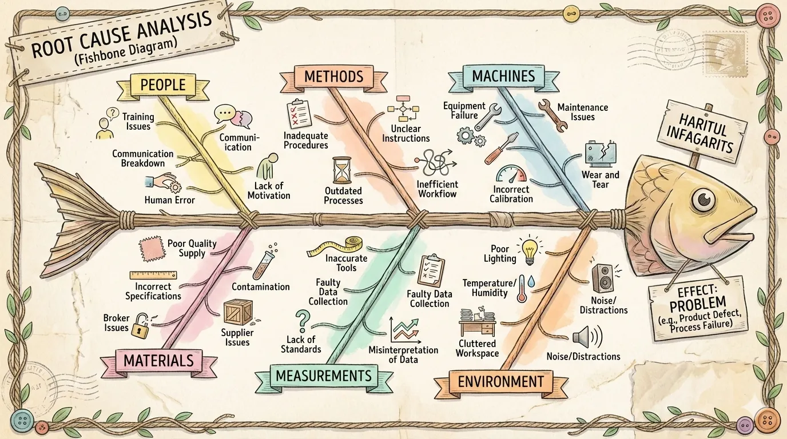 |  |  |
| fishbone | funnel | grid-cards |
| 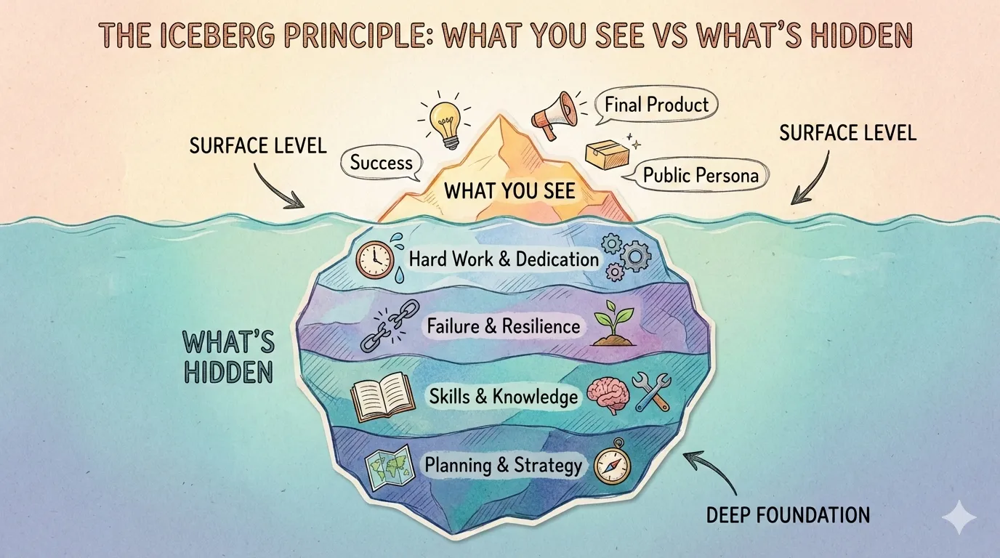 | 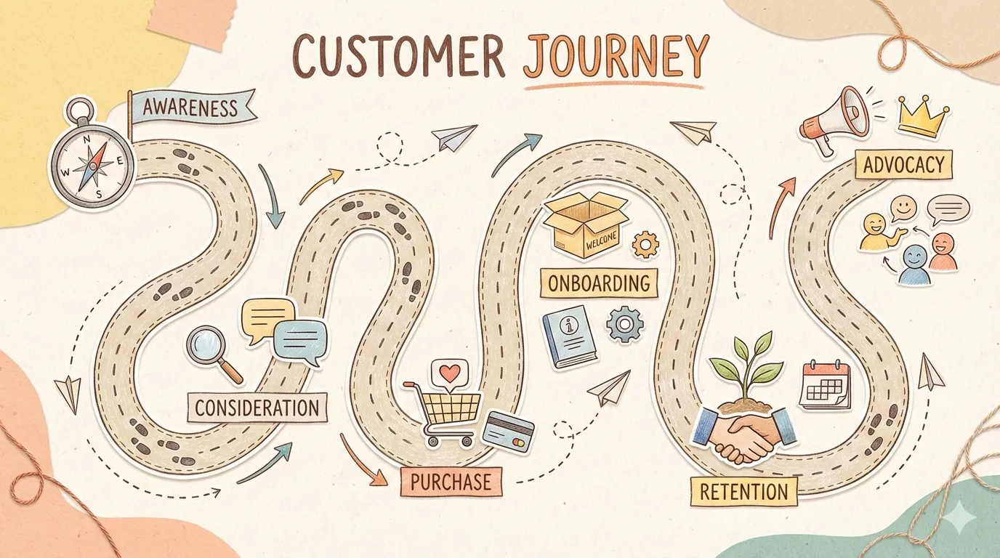 | 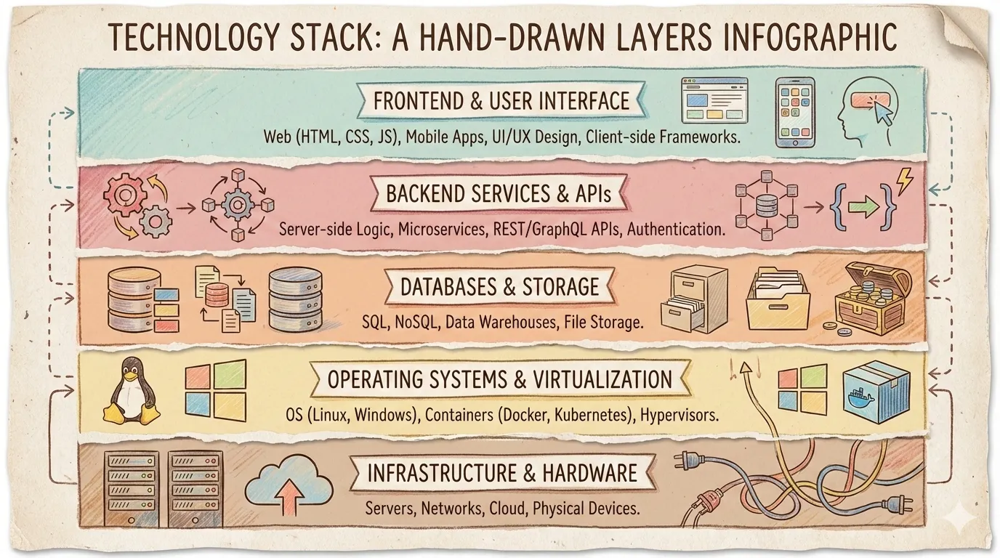 |
| iceberg | journey-path | layers-stack |
|  |  |  |
| mind-map | nested-circles | priority-quadrants |
|  |  | 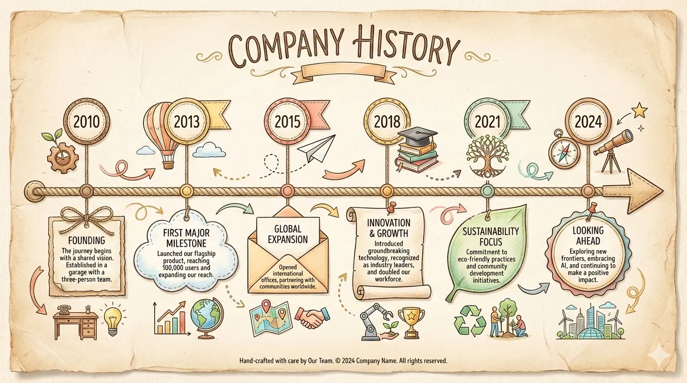 |
| pyramid | scale-balance | timeline-horizontal |
| 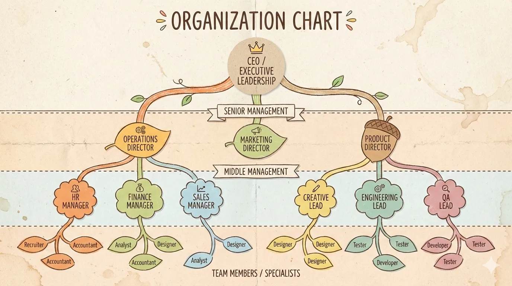 | 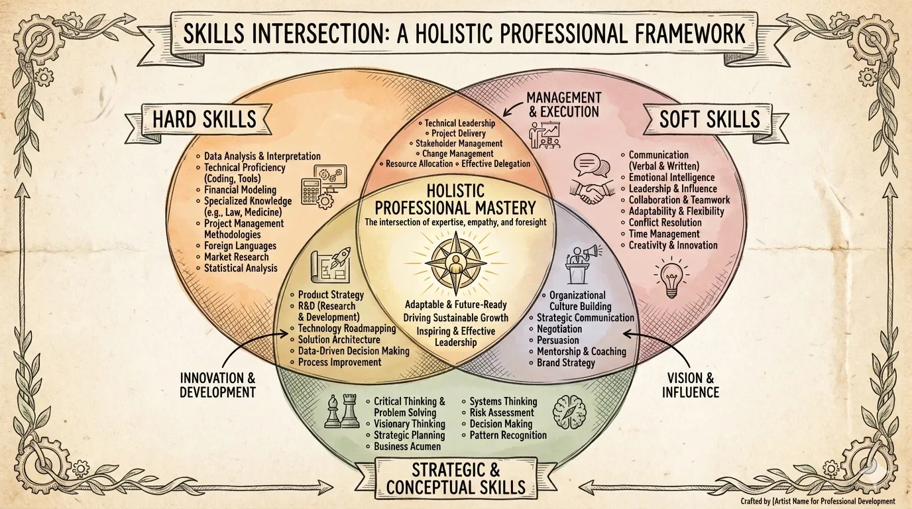 | |
| tree-hierarchy | venn | |

**风格**（视觉美学）：

| 风格 | 描述 |
|------|------|
| `craft-handmade`（默认） | 手绘插画、纸艺风格 |
| `claymation` | 3D 黏土人物、定格动画感 |
| `kawaii` | 日系可爱、大眼睛、粉彩色 |
| `storybook-watercolor` | 柔和水彩、童话绘本 |
| `chalkboard` | 彩色粉笔、黑板风格 |
| `cyberpunk-neon` | 霓虹灯光、暗色未来感 |
| `bold-graphic` | 漫画风格、网点、高对比 |
| `aged-academia` | 复古科学、泛黄素描 |
| `corporate-memphis` | 扁平矢量人物、鲜艳填充 |
| `technical-schematic` | 蓝图、等距 3D、工程图 |
| `origami` | 折纸形态、几何感 |
| `pixel-art` | 复古 8-bit、怀旧游戏 |
| `ui-wireframe` | 灰度框图、界面原型 |
| `subway-map` | 地铁图、彩色线路 |
| `ikea-manual` | 极简线条、组装说明风 |
| `knolling` | 整齐平铺、俯视图 |
| `lego-brick` | 乐高积木、童趣拼搭 |

**风格预览**：

| | | |
|:---:|:---:|:---:|
|  | 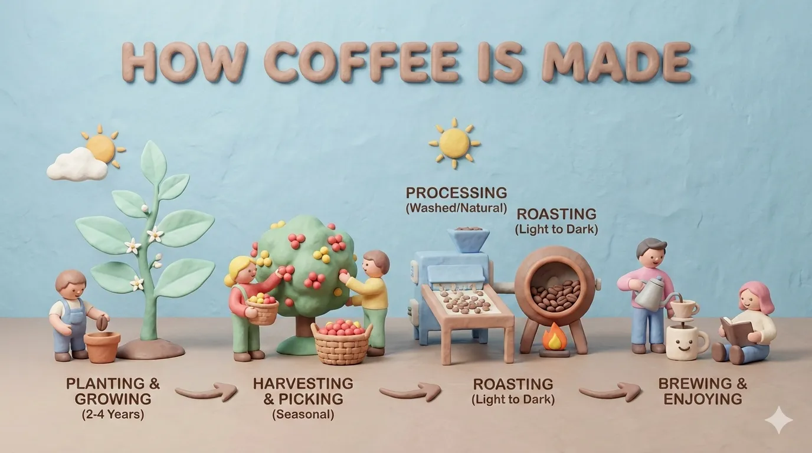 |  |
| craft-handmade | claymation | kawaii |
| 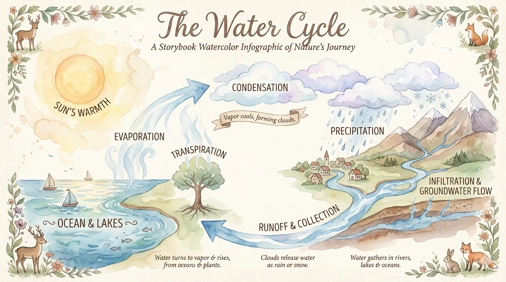 |  |  |
| storybook-watercolor | chalkboard | cyberpunk-neon |
| 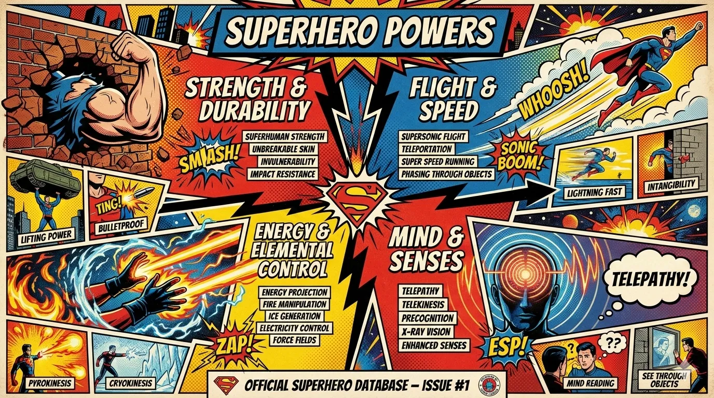 |  | 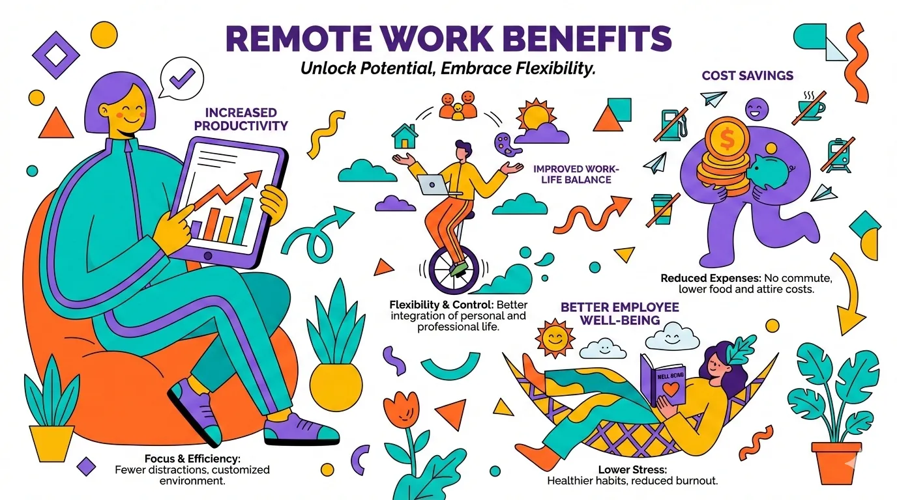 |
| bold-graphic | aged-academia | corporate-memphis |
|  | 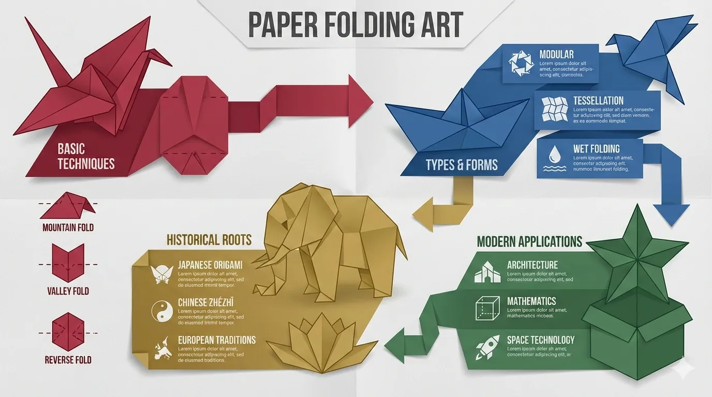 |  |
| technical-schematic | origami | pixel-art |
| 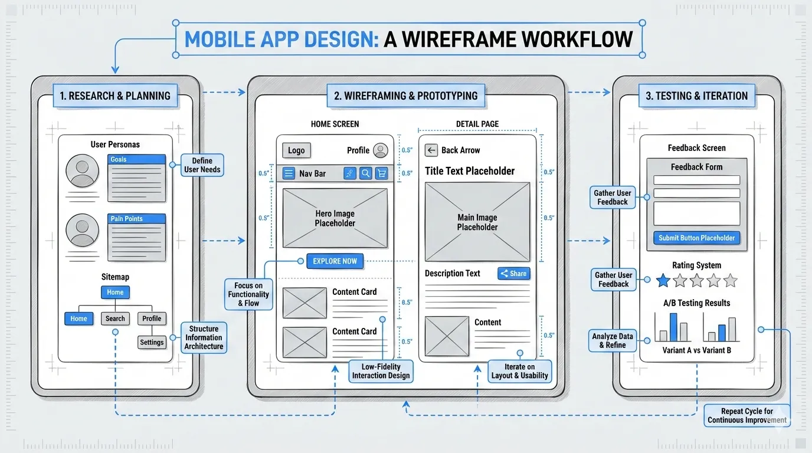 |  | 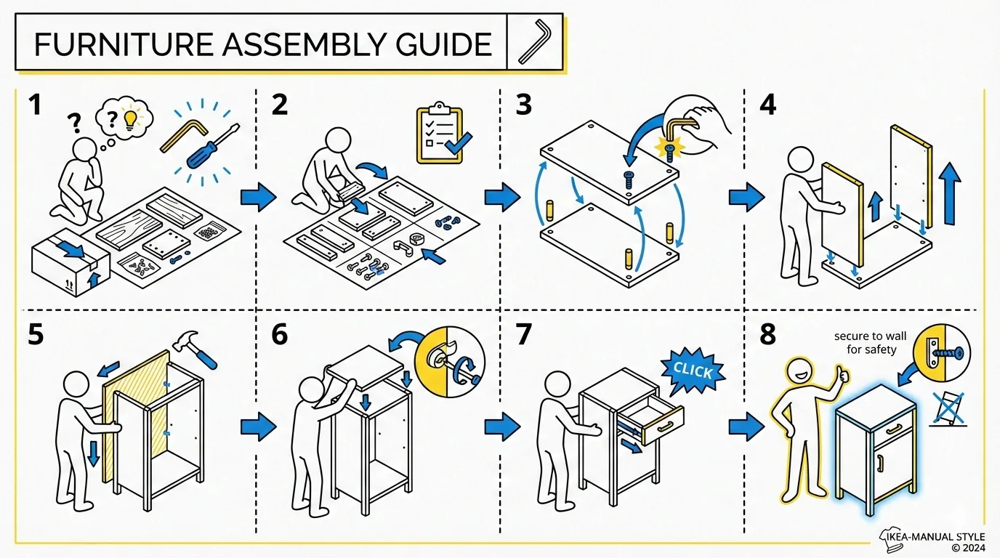 |
| ui-wireframe | subway-map | ikea-manual |
| 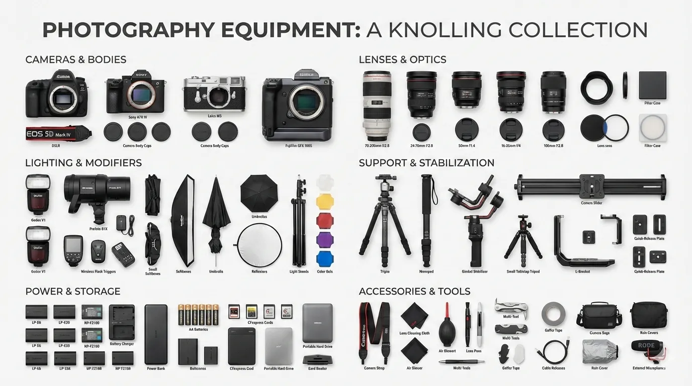 |  | |
| knolling | lego-brick | |
