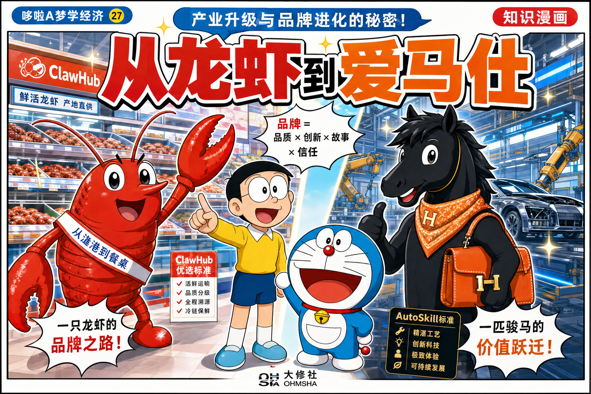
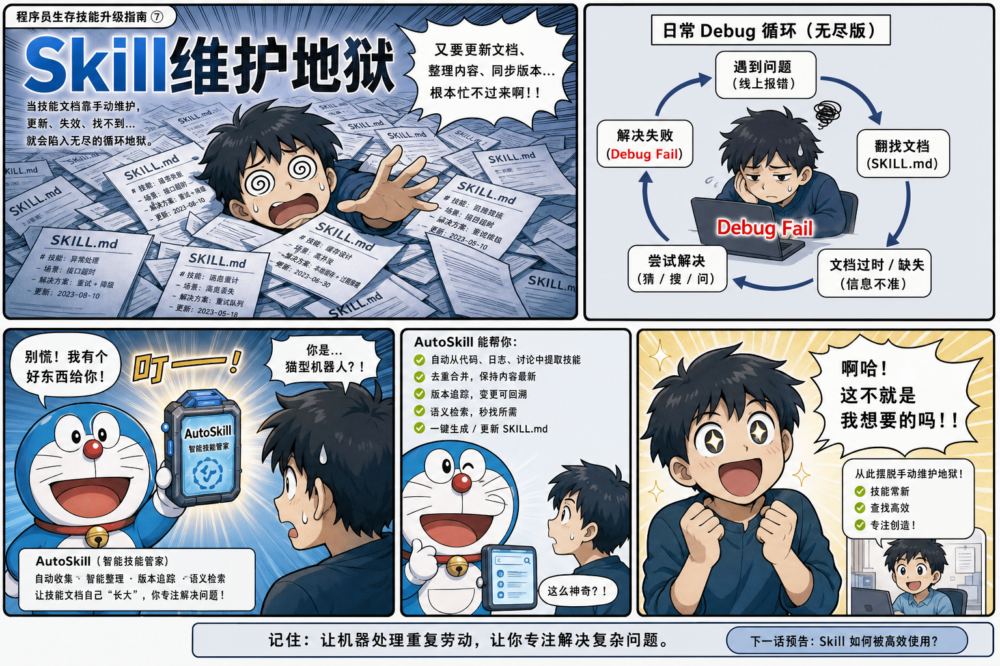
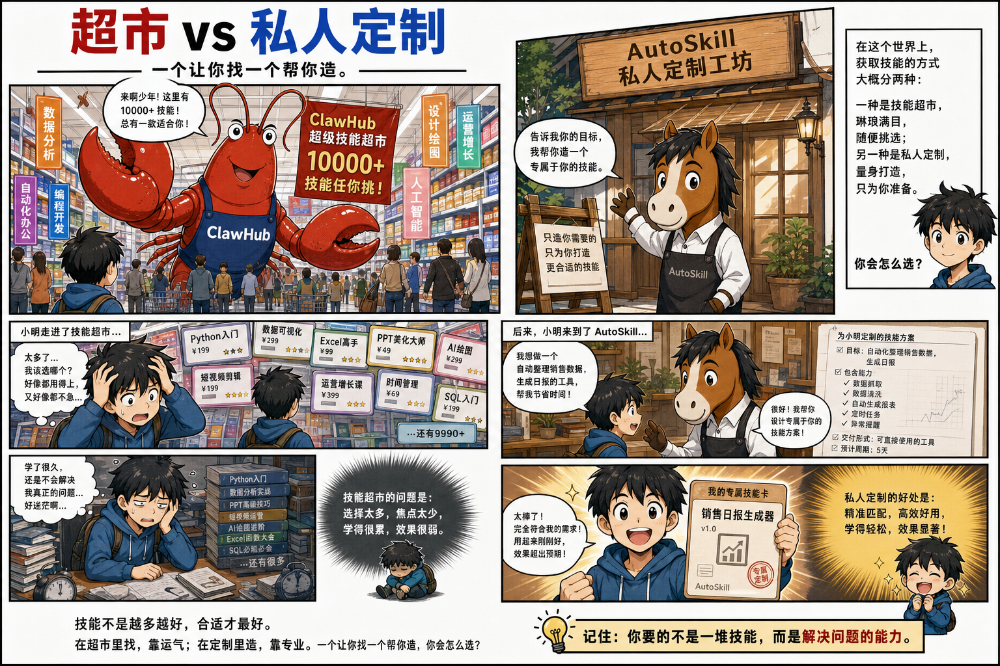
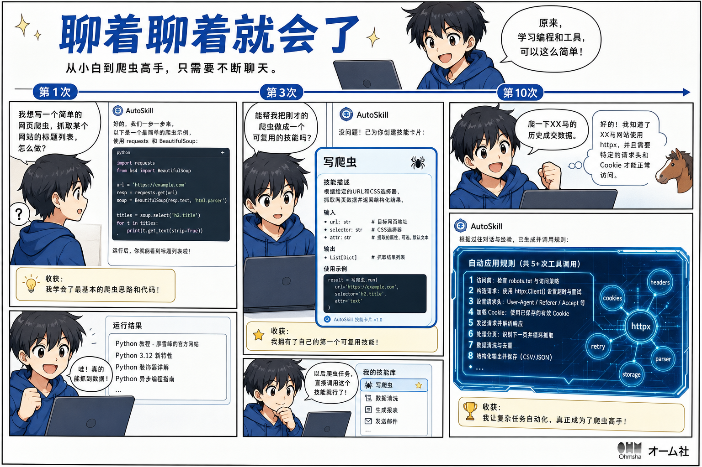
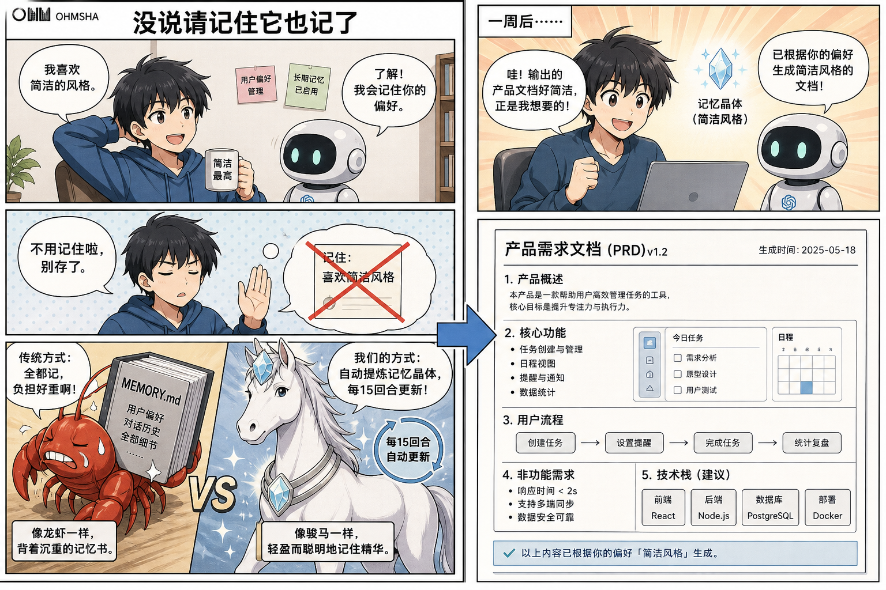
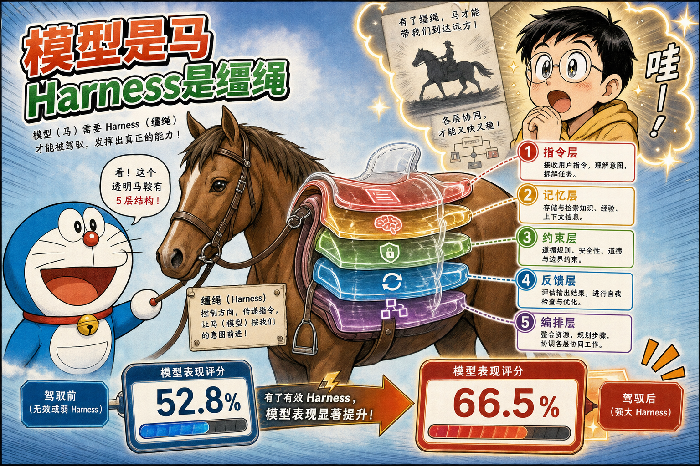
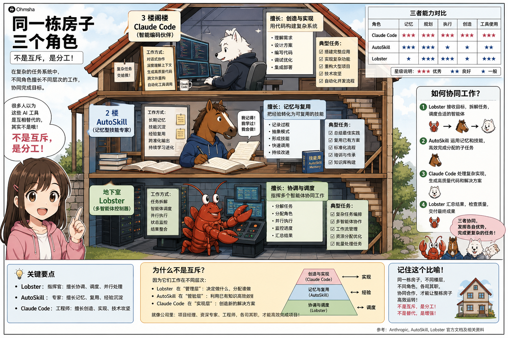
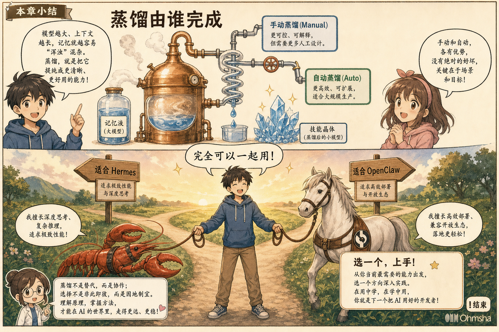

# 从龙虾到爱马仕：我为什么放弃了手动维护 Skill



2026 年 4 月，一匹黑马闯入视野。Nous Research 开源的 **Hermes Agent**（爱马仕），46 天 GitHub Stars 破 10 万，史上第二快。AI 圈又炸锅了。

但作为一个深度使用龙虾（OpenClaw）的用户，我最想问的问题是：**它和龙虾的区别到底是什么？普通人应该继续养虾，还是换马养？**

用了两周后，我有了一些真实的答案。

---

## 一、Hermes 切中了什么痛点？

我每天用龙虾做产品调研、出方案、思考。好处不用多说，但有一个痛点一直困扰我——

**Skill 维护太麻烦了。**

想让龙虾做复杂的事，得自己写 Skill。写完调试，调试完维护。好不容易打磨出一个顺手的，换个场景又不好使了。有时候花在写 Skill 上的时间，比自己手动做还长。



Hermes 推出了一个叫 **AutoSkill 自进化技能** 的功能：它能在对话过程中，自动帮你把经验总结成 Skill。

我当时想：这不就是我想要的吗？于是直接上手试了。

---

## 二、试用两周，几个真实的 Aha 时刻

### 1. 预装了一批高质量 Skill

它自带一批预装的优质 Skill，按需启用，开箱即用。

龙虾的 ClawHub 有上万个社区 Skill，生态确实更大。但 Hermes 的思路完全不同——不是让你去找 Skill，而是**帮你自动创建 Skill**。

一个是「超市模式」，一个是「私人定制」模式。



### 2. 聊着聊着，它自己建了好几个 Skill

装好后正常聊天、让它干活，没做任何特殊操作。过了一段时间去看 Skill 目录——它自己把对话总结成了好几个可复用的技能。

- **第 1 次**：让它写爬虫 → 写了，能用，就是普通脚本
- **第 3 次**：又写了一个类似爬虫 → 它发现规律，自动创建了「写爬虫」的 Skill
- **第 10 次**：我只说「爬一下 XX」→ 秒懂，知道我喜欢用 httpx，日志写文件，异常处理用我习惯的方式

**从「我维护 Skill」变成了「它帮我维护 Skill」。**



当然不完美——自动创建的 Skill 会有重复，需要定期整理。但这个方向是对的。

系统指令里的设计很有意思：

> `5+ tool calls` — 简单任务不建 Skill，只有 5 步以上的复杂流程才创建  
> `fixing a tricky error` — 踩过的坑最有价值  
> `don't wait to be asked` — Agent 自主判断  
> `Skills that aren't maintained become liabilities` — 不只创建，还在使用中持续改进

### 3. 我没说「请记住」，它自己就记了

关键区别是：**我从头到尾没说过「请记住这个」。**

用了一周后随口说「帮我写个产品文档」，它直接用简洁风格输出。因为上周我顺嘴提了一句「我喜欢简洁风格，不要废话」。

龙虾需要你主动维护 MEMORY.md，或明确说「记住这个」才会存。Hermes **默认开着自动记忆**——大约每 15 轮对话主动做一次「反思」，把有价值的信息提炼写入持久记忆。



### 4. 说到一半能补充——嘴瓢星人的福音

跟 AI 聊到一半想补充内容，龙虾不支持。Hermes 可以——补充的部分会自动合并进上下文，不会打断对话流，也不会丢失已有信息。

---

## 三、本质——这些工具在解决什么问题？

### Harness 架构：一张图看懂 AI Agent

**AI 的瓶颈不是模型本身，而是模型周围的环境。** 同一个模型，只调整「Harness」配置，任务成绩从 52.8% 涨到 66.5%。

**模型是马，但马跑多快，不只取决于马本身。**

| 层级 | 作用 | 代表技术 |
|------|------|----------|
| **指令层** | 告诉 AI「做什么、怎么做」 | Skill / SOUL.md / CLAUDE.md |
| **记忆层** | 让 AI「记得住」 | MEMORY.md / 会话记忆 / 知识库 |
| **约束层** | 给 AI「画红线」 | sandbox / hooks / 权限控制 |
| **反馈层** | 让 AI「会反思」 | 学习循环 / 人工审查 / 评估 |
| **编排层** | 让 AI「能协作」 | Multi-Agent / Sub-Agent / cron |



### 不同工具，侧重不同的层

| Harness 层 | OpenClaw 🦞 | Hermes 🐴 | Claude Code |
|-----------|------------|-----------|-------------|
| **指令层** | 人工写 SOUL.md / Skill | **自动创建 + 自改进** ✨ | 人工写 CLAUDE.md |
| **记忆层** | MEMORY.md（人工维护为主） | **三层记忆 + 自动固化** ✨ | 项目级记忆（跟项目走） |
| **约束层** | 配置透明，明文可审计 | sandbox + 工具权限 | hooks + linter |
| **反馈层** | Dreaming（实验性，默认关） | **闭环学习循环（默认开）** ✨ | 人工审查 |
| **编排层** | Multi-Agent + Sub-Agent | Sub-Agent（能力有限） | Sub-Agent 交互 |



> 它们不是三条平行线，是同一栋房子里分工不同的三个角色。

### Skill 和记忆，本质上都是知识

- **记忆**是你告诉 AI 的原始信息（「我喜欢简洁风格」）
- **Skill**是从记忆中蒸馏出来的可复用知识（「写文档时默认简洁风格」）
- **知识 = 记忆 + 技能**

**核心区别不是谁更强，而是「蒸馏由谁完成」。** 手动的好处是透明可控，自动的好处是省心省力。



---

## 四、冷静看优缺点

### Hermes 的优点

| 优势 | 用户价值 |
|------|---------|
| **自动创建 + 改进 Skill** | 从「我维护」变成「它维护」 |
| **默认自动记忆** | 不用手动写 MEMORY.md |
| **成本低** | $5 VPS + API 费，月成本 < $10 |
| **本地存储 + MIT 开源** | 数据在自己服务器 |
| **24/7 后台运行** | 定时任务、自动监控 |
| **轻量** | 内存 < 500MB |

### Hermes 的缺点

| 局限 | 影响 |
|------|------|
| **自动 Skill 有重复和噪声** | 需要定期整理 |
| **生态没龙虾成熟** | ClawHub 有上万个 Skill |
| **Multi-Agent 能力有限** | 只有 Sub-Agent |
| **记忆系统稍黑盒** | 不如 MEMORY.md 明文可见 |
| **安全性仍在追赶** | 建议装远程机器 |

---

## 五、没有完美工具，只有合适选择

**不要把它们当互斥的选择题。**

**适合 Hermes：** 希望 AI 自动进化、长期个人助理、任务多变、24/7 自动化

**适合 OpenClaw：** 团队协作可审计、对外服务、稳定执行不希望「突然学会新东西」

专注编码 → Claude Code；日常轻量 → 用顺手的就行。

**关键：多用。** 选一个上手、用起来、让它帮你干活。

---

## 六、快速入门

```bash
# 第 1 步：安装（5 分钟）
curl -sSL https://hermes-agent.com/install.sh | bash

# 第 2 步：配置 API Key（1 分钟）
nano ~/.hermes/config.yaml

# 第 3 步：开始对话
hermes
```

### 推荐资源

| 类别 | 链接 |
|------|------|
| 📖 官方文档 | https://hermes-agent.nousresearch.com/docs |
| 🐙 GitHub 仓库 | https://github.com/nous-research/hermes-agent |
| 🔰 腾讯云部署教程 | https://cloud.tencent.com/developer/article/2653159 |

---

## 漫画页索引（baoyu-comic 输出）

| 页 | 文件 | 内容 |
|----|------|------|
| 封面 | `00-cover-lobster-to-hermes.png` | 养虾还是养马 |
| P1 | `01-page-hermes-arrives.png` | 黑马闯入 |
| P2 | `02-page-skill-pain.png` | Skill 维护痛点 |
| P3 | `03-page-supermarket-vs-custom.png` | 超市 vs 定制 |
| P4 | `04-page-autoskill-evolution.png` | AutoSkill 进化 |
| P5 | `05-page-auto-memory.png` | 自动记忆 |
| P6 | `06-page-harness-five-layers.png` | Harness 五层 |
| P7 | `07-page-three-agents-house.png` | 三工具分工 |
| P8 | `08-page-choice-ending.png` | 蒸馏与选择 |

角色参考表：`comic/lobster-to-hermes/characters/characters.png`  
完整工程目录：`comic/lobster-to-hermes/`（含 analysis、storyboard、prompts）
