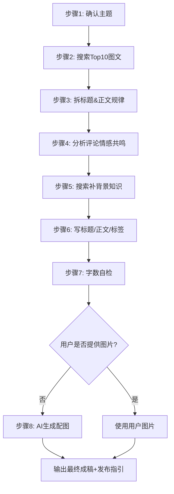

# Write Xiaohongshu（小红书爆款创作助手）

## 📋 Skill 概述

Write Xiaohongshu 是一个专业的小红书图文创作工具，通过研究爆款内容规律、分析用户情感共鸣点，帮助用户快速生成符合平台调性的优质文案。

### 核心功能

1. **爆款研究**：分析同类主题的 Top 图文帖，提取标题/正文规律
2. **情感分析**：从评论中挖掘用户共鸣点和互动触发点
3. **背景补充**：通过搜索补充事实信息，避免内容空洞
4. **文案生成**：输出符合小红书调性的标题+正文+标签
5. **AI 配图**：使用 Seedream 生成 9:16 竖版配图（可选）
6. **发布指引**：提供完整发布步骤，用户手动复制到小红书

### 硬性限制（必须遵守）

- **标题**：≤ 20 字符
- **正文**：≤ 1000 字符

> 计数口径：按字符计数（包含空格、标点、换行、#话题等）。建议标题≤18，正文≤950，留余量。

---

## 🚀 使用方法

### 方式一：给一个主题，生成完整文案（含AI配图）

```
用户：写一篇小红书图文，主题是"上班族快速晚餐"，适合一个人，预算 20 元以内。

Skill：[自动执行步骤 1→6]
  1. 搜索相关爆款图文，分析规律
  2. 分析评论情感共鸣点
  3. 补充背景知识
  4. 生成标题+正文+标签
  5. 使用 Seedream 生成 1~2 张 9:16 配图
  6. 输出最终成稿+发布指引
```

### 方式二：用户提供图片，配文案

```
用户：我有几张带饭的照片，帮我写一篇小红书，主题是"打工人一周便当"。

Skill：执行步骤 1→4 和 6，跳过步骤 5（生图），使用用户提供的图片
```

### 方式三：仅生成文案，不配图片

```
用户：帮我写个小红书文案，主题是"新手化妆避坑"，不用配图。

Skill：执行步骤 1→4 和 6，跳过步骤 5，不提供配图
```

---

## 📤 输出格式

本 Skill 输出包含三部分：

### 1) 分析总结报告
完成研究后先输出，结构如下：
```text
【分析总结报告】
评论数/互动量排名（从高到低）
1. <标题> - <评论数>（<图文/视频>）
2. ...
...

标题规律分析
- <规律1>
- <规律2>
...

内容规律分析
- <规律1>
- <规律2>
...

封面规律分析
- <规律1>
- <规律2>
...

总结
爆款三要素：
1. <要素1>
2. <要素2>
3. <要素3>

互动催化剂：
- <催化剂1>
- <催化剂2>
...
```

### 2) 最终可发布成稿
```text
标题：<不超过20字符>

正文：
<不超过1000字符>

标签：#标签1 #标签2 #标签3 ...

配图建议：
- 数量：1~2 张
- 比例：9:16 竖图优先
- 风格：<具体描述>
- 搜索关键词：<用于找图的英文关键词>
```

### 3) 发布指引
```text
📱 发布步骤：
1. 打开小红书 App
2. 点击底部"+" → 选择"图文"
3. 上传配图（按上述建议）
4. 粘贴标题和正文
5. 添加标签
6. 点击发布
```

---

## 🔧 总流程（必须按顺序执行）



---

## 📖 详细步骤说明

### 步骤 1：确认主题和需求

与用户确认：
- 主题是什么？
- 目标人群？（学生党/打工人/宝妈等）
- 口吻风格？（温柔/干练/活泼等）
- 是否提供图片？

### 步骤 2：搜索相关"点赞Top10"图文帖

**目标**：找出同类内容最受欢迎的写法。

**要求**：
- 搜索与主题相关的爆款图文
- 筛选高点赞、高互动的帖子
- 收集 10+ 条有效样本

**记录字段**：
- 标题（原文）
- 点赞/收藏/评论数
- 正文结构（用1行概括）
- 关键钩子（开头吸引点）
- 证据类型（体验/对比/数据/截图）
- 互动设计（提问/投票/抽奖等）

### 步骤 3：总结爆款规律

输出可直接复用的规律：
- **标题规律**：长度、句式、关键词、符号/数字、情绪词、利益点
- **正文规律**：段落节奏、清单/步骤、转折、避坑、结尾 CTA、口吻风格
- **点赞高的原因**：至少3条，落地到写法/信息密度/共鸣点/可执行性

### 步骤 4：分析评论情感共鸣

**目标**：找出观众为什么想留言/转发/收藏。

**共鸣触发点分类**：
- 共同痛点（我也是…）
- 身份认同（打工人/学生党/宝妈…）
- 焦虑与解决（终于有办法/被拯救）
- 价值观（自律、松弛感、性价比、极简…）
- 反差/意外（原来这样也行）
- 可复制性（我也能照做）
- 分享欲（我也想试试）
- 好奇心（这是什么？）

**输出**：3~6个共鸣点结论，每个配1~2条原话片段。

### 步骤 5：补充背景知识

**目标**：避免内容空、避免错误/夸大。

**做法**：
- 搜索主题相关的概念解释、常见误区、权威建议
- 提炼为5~10条可引用的背景要点
- 对易被质疑的说法做降级处理（"我个人体验/适合一部分人"）

### 步骤 6：撰写文案

**写作要求**：
- 口语化、句子短、1-3句换行
- 信息密度高：少空话，多"可照做的步骤/清单"
- 适当使用 emoji，但不要堆
- 结尾自然，像真实用户写的

**去 AI 味技巧**：
- 多写"我/我当时/我发现/我踩过的坑"
- 给2~3个具体细节（时间、场景、对比）
- 允许不完美："我感觉/我猜/可能/不确定但…"
- 少模板话：避免"总的来说/综上/因此/首先其次最后"
- 像跟朋友聊天：短句、断行、偶尔口头词

### 步骤 7：字数自检

**字数闸口**：
- 标题 > 20字符：删冗余词、去副标题、改短句
- 正文 > 1000字符：先删重复口头禅，再合并句子，再压缩步骤
- 最终只输出合规版本

### 步骤 8：AI 生成配图（用户未提供图片时）

**目标**：为文案生成匹配的 9:16 竖版配图。

**调用方式**：
```bash
python {skillDir}/scripts/generate_image.py --prompt "<优化后的图片描述>" --filename "<输出路径>.jpg" --aspect-ratio 9:16 --resolution 2K
```

**参数说明**：
- `--prompt`：图片描述（使用 5维增强矩阵 优化后的提示词）
- `--filename`：输出文件路径（建议使用 `.jpg`）
- `--aspect-ratio 9:16`：小红书最佳比例
- `--resolution 2K`：分辨率（2K 或 3K）

**提示词优化（5维增强矩阵）**：
根据文案主题，从以下维度构建提示词：
- **主体(Subject)**：细节描述（纹理、材质、动作）
- **环境(Environment)**：背景氛围（天气、地点、季节）
- **光影(Lighting)**：光源类型（背光、柔光、冷暖对比）
- **镜头(Camera)**：专业参数（85mm人像、电影感宽画幅）
- **质感(Texture)**：非AI感细节（胶片颗粒、真实纹理）

**示例提示词**：
| 主题 | 基础描述 | 优化后提示词 |
|------|---------|-------------|
| 便当 | 精美的便当盒 | 日式木质便当盒，自然光线从窗户斜射，85mm镜头浅景深，温暖色调，胶片质感，9:16竖图 |
| 化妆台 | 化妆品摆放 | ins风白色化妆台，环形补光灯柔和照明，俯拍视角，产品质感清晰，简约背景，9:16竖图 |
| 学习场景 | 书桌学习 | 温馨书桌角落，暖黄台灯照明，笔记本和咖啡杯，窗外黄昏光线，生活感氛围，9:16竖图 |

**输出处理**：
- 生成 1~2 张图片
- 保存到用户可访问的目录
- 输出图片绝对路径
- 如果生成失败，回退到"配图搜索建议"

---

## 🖼️ 配图规范

### 用户未提供图片时（AI生成）

```text
配图：AI生成 9:16 竖图
- 数量：1~2 张
- 分辨率：2K
- 风格：<与文案主题匹配>
- 文件路径：<绝对路径>
```

### 用户提供图片时

```text
配图：使用用户提供的图片
- 数量：<X> 张
- 建议：确保图片为 9:16 竖图，清晰明亮
```

### 用户不需要图片时

```text
配图：无（纯文字笔记）
```

---

## 💡 示例

### 示例 1：用户只给主题（AI生成配图）

**用户输入**：
> 写一篇小红书图文：主题是"上班族快速晚餐"，适合一个人，预算 20 元以内。

**Skill 执行**：
1. 搜索"上班族晚餐/快手菜/一人食"等关键词的爆款图文
2. 分析标题规律、正文结构、评论共鸣点
3. 补充"健康/备餐/安全"相关背景
4. 生成文案
5. 使用 Seedream 生成配图
6. 输出最终成稿+发布指引

**输出**：
```text
【分析总结报告】
...

标题：打工人晚餐｜10分钟搞定 15元/顿

正文：
下班累到不想动？这3道菜救了我🍳

周一：番茄鸡蛋面
鸡蛋2个+番茄1个+挂面
10分钟，汤汁拌饭绝了

周二：青椒炒蛋饭
青椒2个+鸡蛋2个+剩饭
5分钟搞定，香到舔盘

周三：紫菜蛋花汤+馒头
紫菜+鸡蛋+虾皮
暖胃又省钱，懒人必备

3天总成本45元，平均15元/顿
比外卖便宜一半，还健康！

你们晚上一般吃什么？
评论区交换菜单～

标签：#打工人带饭 #一人食 #快手菜 #省钱攻略 #晚餐吃什么

配图：AI生成 9:16 竖图
- 数量：2张
- 分辨率：2K
- 风格：温馨食物特写，自然光线
- 文件路径：
  - C:\Users\CF\Pictures\xhs_dinner_01.jpg
  - C:\Users\CF\Pictures\xhs_dinner_02.jpg

📱 发布步骤：
1. 打开小红书 App
2. 点击底部"+" → 选择"图文"
3. 上传上述 2 张配图
4. 粘贴标题和正文
5. 添加标签
6. 点击发布
```

### 示例 2：用户提供图片

**用户输入**：
> 我有5张竖图（9:16），帮我写一篇小红书，主题是"新手化妆避坑"，偏温柔口吻。

**Skill 执行**：执行步骤 1~4 和 6，跳过步骤 5（AI生图），使用用户提供的图片。

### 示例 3：仅生成文案，不配图片

**用户输入**：
> 帮我写个小红书文案，主题是"新手化妆避坑"，不用配图。

**Skill 执行**：执行步骤 1~4 和 6，跳过步骤 5，不生成配图。

---

## 📁 配套工具

### 核心脚本

| 脚本 | 用途 | 命令 |
|------|------|------|
| `scripts/generate_image.py` | AI 生成配图 | `python scripts/generate_image.py --prompt "..." --filename "out.jpg" --aspect-ratio 9:16` |

### xhs-utils 工具集（可独立使用）

| 工具 | 用途 | 命令 |
|------|------|------|
| `char-counter.js` | 字数检查 | `node char-counter.js --title "xxx"` |
| `ai-tone-detector.js` | AI味检测 | `node ai-tone-detector.js --file draft.txt` |
| `comment-sentiment.js` | 评论情感分析 | `node comment-sentiment.js --demo` |
| `pattern-analyzer.js` | 爆款规律分析 | `node pattern-analyzer.js --demo` |
| `image-finder.js` | 配图搜索建议 | `node image-finder.js --topic "xxx"` |

---

## ⚠️ 注意事项

1. **本 Skill 不直接发布**，仅生成文案和配图，用户需手动复制到小红书 App 发布
2. **必须遵守字数限制**，标题≤20，正文≤1000
3. **研究样本≥10条**才能进入写作步骤，否则停止并告知用户
4. **去 AI 味是必须的**，多用"我"、具体细节、口语化表达
5. **AI 配图依赖**：
   - 需要 Python 环境：`python -c "import openai, PIL; print('ok')"`
   - 如失败则安装：`python -m pip install openai pillow`
   - 需要 EasyClaw 登录配置（`~/.easyclaw/` 目录）
   - 生图失败时会回退到"配图搜索建议"

---

## 📝 更新日志

### v1.0.0 (2025-03-20)
- 初始版本发布
- 支持爆款研究→情感分析→文案生成完整流程
- 附带 xhs-utils 工具集
