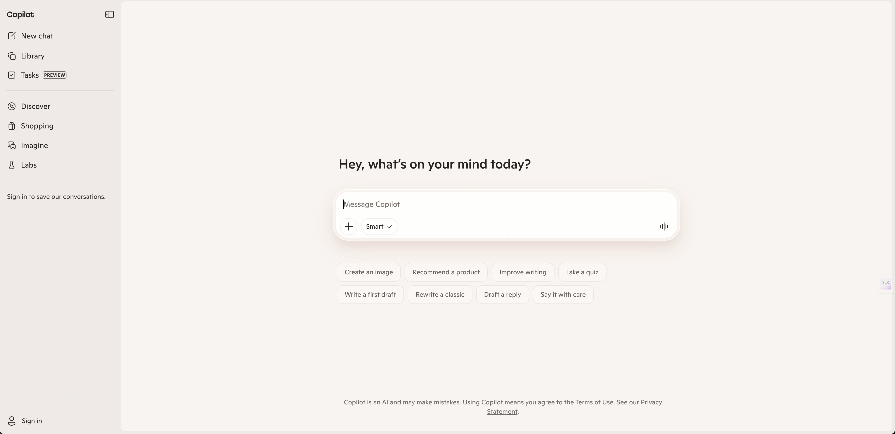

---
name: cyl-product-experience-report
description: Execute a lightweight product experience workflow with browser interaction, staged screenshots, and a structured report. Use when the user asks for product体验, 体验+截图+报告, 产品试用记录, or UX walkthrough documentation.
---

# Product Experience Report

## Purpose

Run a repeatable workflow for:
1. Minimal product walkthrough
2. Evidence screenshots
3. Structured PM-style report
4. Save artifacts to project folders

## Inputs To Confirm

Before execution, confirm or infer:
- Product URL (example: `https://www.perplexity.ai`)
- Operation style (default: minimal actions)
- Output folder (default: this skill folder: `.cursor/skills/product-experience-report`)
- Screenshot folder (default: `<output>/image`)
- Report file name (default: `<Product>-产品体验报告-YYYY-MM-DD.md`)

If user already gave these, do not ask again.

## Execution Workflow

### 1) Browser walkthrough (minimal action)

- Open target URL.
- Use minimal interaction to complete one core task:
  - home page observation
  - one query/task attempt
  - result/details page observation
- Keep actions minimal and low-risk. Do not log in unless user explicitly asks.

### 2) Screenshot collection (required)

Capture at least 4 screenshots:
- S1: home page
- S2: before input/action
- S3: after input/action
- S4: result/details page

Recommended extra:
- S5: final state before ending

### 3) Completion rule

- End the walkthrough when core evidence is complete:
  - homepage observed
  - one core task attempted/completed
  - result/details page observed
  - required screenshots captured
- Prefer short waits (1-3s loops) only when waiting for UI changes.

### 4) File organization

- Save report and screenshots only inside this skill folder.
- Do not save artifacts to other project directories unless user explicitly requests it.
- Create screenshot directory if missing.
- Copy/move screenshots into `<output>/image`.
- Delete temporary duplicates if user asks to keep only project copies.

### 5) Report writing

Write report with:
- context (time, platform, duration, method)
- conclusion
- screenshot-based observations
- strengths
- issues/risks
- prioritized suggestions (P0/P1/P2)
- scoring
- next validation plan

Use relative image links (no absolute temp paths):
- `./image/<filename>.png`

## Report Template

Use this structure:

```markdown
# <Product> 产品体验报告（最小化操作）

- 体验时间：<YYYY-MM-DD>
- 体验平台：Web（<URL>）
- 体验方式：最小化操作（<path>）
- 体验时长：<实际体验时长>

## 一、结论摘要
<2-4 句>

## 二、截图与观察（结合证据）

### 截图 1：<title>

- 观察：
  - ...

### 截图 2：<title>

- 观察：
  - ...

### 截图 3：<title>

- 观察：
  - ...

### 截图 4：<title>

- 观察：
  - ...

## 三、核心体验评估
### 1) 价值传达
### 2) 任务完成效率
### 3) 可验证性
### 4) 连续使用动机

## 四、问题清单与改进建议
### P0（高优先级）
### P1（中优先级）
### P2（可迭代）

## 五、评分（本次轻体验）
- 首轮上手：x/10
- 答案可用性：x/10
- 可验证性：x/10
- 交互稳定性：x/10
- 综合评分：x/10

## 六、后续建议
<2-3 条可执行验证计划>
```

## Quality Bar

- Observations must map to screenshots, not generic comments.
- Keep claims factual; mark uncertain points as "to verify".
- Do not fabricate successful steps if blocked; record workaround clearly.
- Keep language concise and PM-oriented.
